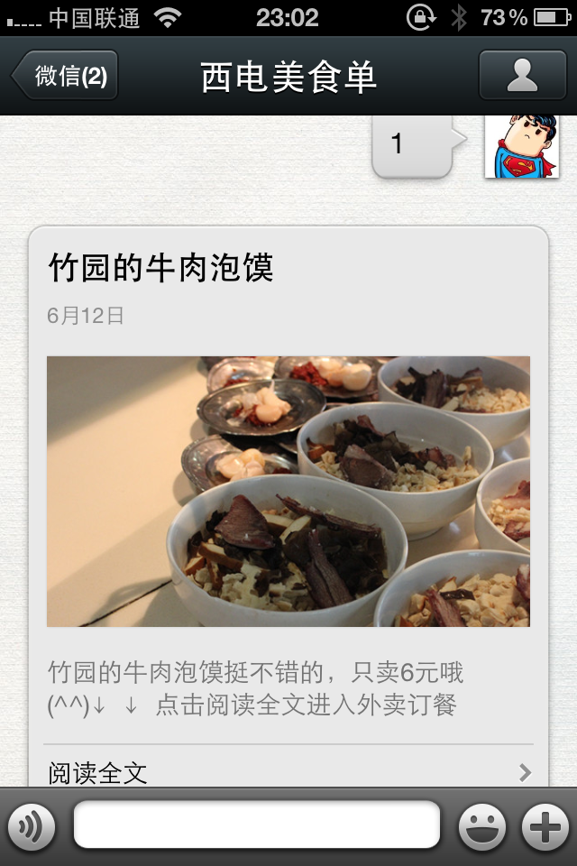

#XD-msd西电美食单
* 截图
 

* 主页地址http://cfdtlee.sinaapp.com/mamain.html
* Wechat ID(微信公众号)xd-msd

---

#What is XD-msd
* 一个为解决西电人吃饭难，决定难的问题而出现的项目
* 一个致力于将西电美食网络化的项目
* 项目包括两个平台：web端和微信端
* 项目实现了对西电美食的展示、推荐，线上外卖订餐，用户口味的制定等一个吃货所需的功能

---

#Innovate(创新)
* web端与微信端共用后台（包括数据库、订购页面等）实现一次开发多处使用
* 以微信ID为身份鉴别标准，大大简化账户管理
* 通过甜度、辣度、肉量等几个值量化美食的味道和用户的口味，并在推荐时使用优化算法实现最佳推荐
* 通过微信端向商家发送订餐消息，节省了话费而且提高了效率
* 商家可以通过微信端发布美食或者活动，减小了数据库建立的难度，增大了商家主动性

---

#Realization(实现)
* 项目语言：html、JS、php、SQL
* web首页通过获取屏幕分辨率计算最优展示列数通过AJAX（发送post请求到后台）动态生成瀑布流
* 点击web首页的图片或者微信图文消息，发送GET请求至getmoreinfo.php，getmoreinfo.php通过传入的food_id动态生成美食的详情和外卖页面
* 外卖页面输入信息后点“怒买之”用post方式提交表单至auto_send.php，触发服务器端发送信息给商家
* 微信公众平台没有提供主动发送消息给用户的接口，这里用auto_send.php hack模拟公众平台登录，实现主动发送消息

---

#File Statement(文件说明)
* img为图片资源，包括部分美食、主页素材
* js为各个页面所用到的javascript脚本文件
* db.php为数据库交互的脚本
* getmoreinfo.php为生成美食的详情信息和在线订购页面的脚本，可以从web主页点击图片进入也可以通过微信公众平台的图文消息中进入
* index.php为微信后台交互的主文件，主要内容为：检测消息是否来自微信服务器的标识；选择回复方案；回复内容的组织。它是微信端交互的核心
* mamain.html为web主页，采用瀑布流的风格布局

---

#About Author
* SSSTA 李爽、徐健铭

---

#Copyleft
* Permission is granted to copy, distribute and/or modify this document under
the terms of the GNU Free Documentation License
